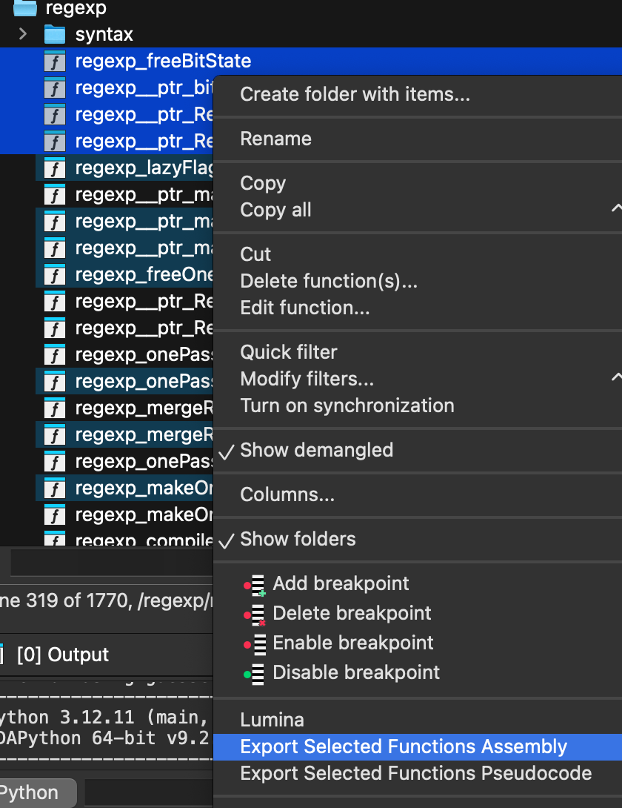

this is a fork of https://github.com/Bizarrus/Assemport , however with increased functionality, allowing exporting of .ASM, and .C psuedocode of selected functions, and all functions. 

For testing: 
